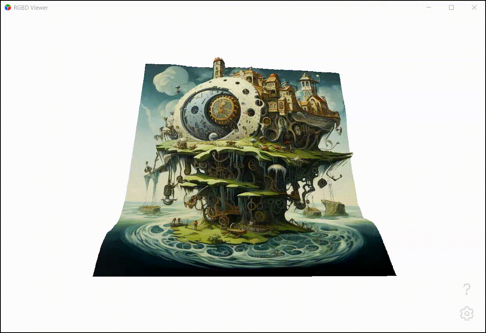

# RGBD (RGB + Depth) Viewer

Simple interactive depthmap viewer written in Qt and QML. You need an image and a grayscale depth map to make it work.

## How to use

1. Use [Left Mouse Button] to rotate the model in 3D space
1. Use [Mouse Wheel] to zoom in and out on the model
1. Use [SHIFT] + [Mouse Wheel] to change the depth map scale
1. The model will start rotating automatically after 5s of inactivity

## Where to get RGBD images

1. A couple of examples are available in the repository's `img` folder
1. Some datasets are available online, like [Middlebury Stereo Datasets](https://vision.middlebury.edu/stereo/data/)
1. Use [AUTOMATIC1111's Stable Diffusion Web UI](https://github.com/AUTOMATIC1111/stable-diffusion-webui) and [stable-diffusion-webui-depthmap-script](https://github.com/thygate/stable-diffusion-webui-depthmap-script) to generate any image you want, depth map is generated automatically
1. Use [MiDaS](https://huggingface.co/spaces/pytorch/MiDaS) to generate depth map for any image